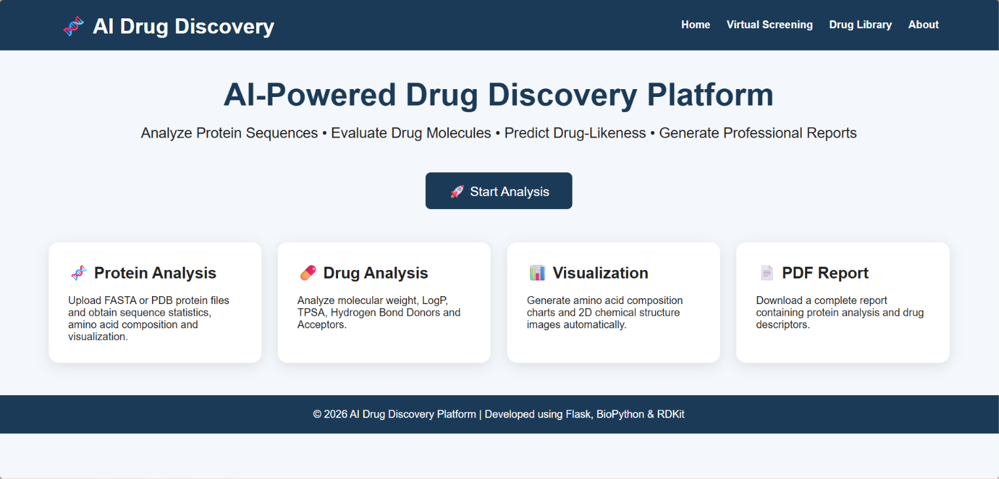
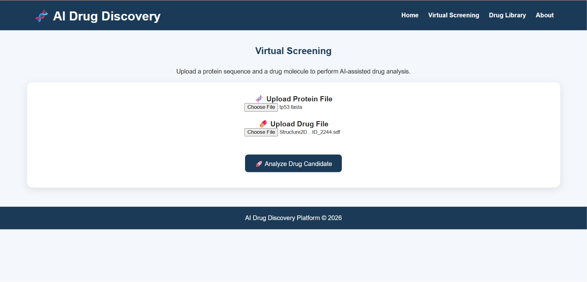
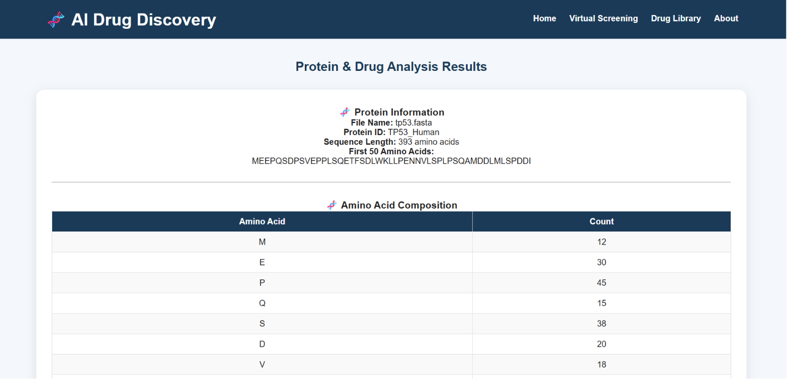

# 🧬 AI Drug Discovery Platform

An AI-assisted Bioinformatics web application developed using **Flask** for protein and drug molecule analysis.  
The platform integrates computational biology techniques and cheminformatics tools to analyze protein sequences, evaluate drug properties, and generate molecular reports.

---

## 🚀 Features

### Protein Analysis
- Upload protein files:
  - FASTA (`.fasta`)
  - Protein structure files (`.pdb`)
- Protein sequence analysis
- Amino acid composition calculation
- Amino acid composition visualization

### Drug Molecule Analysis
- Upload molecular files:
  - SDF (`.sdf`)
  - MOL (`.mol`)
  - MOL2 (`.mol2`)
  - PDB (`.pdb`)
- Drug property calculation using **RDKit**
- Molecular weight calculation
- LogP prediction
- TPSA calculation
- Hydrogen bond donor analysis
- Hydrogen bond acceptor analysis
- Lipinski Rule of Five evaluation
- 2D molecular structure visualization

### Report Generation
- Automated PDF analysis report generation
- Downloadable drug and protein analysis summary

---

## 🧪 Workflow

```
Protein File + Drug Molecule
            |
            ↓
    Flask Web Interface
            |
            ↓
 Protein Sequence Analysis
            |
            ↓
 RDKit Drug Property Analysis
            |
            ↓
 Molecular Visualization
            |
            ↓
 PDF Report Generation
```

---

## 🛠️ Technologies Used

### Programming
- Python

### Web Development
- Flask
- HTML
- CSS

### Bioinformatics & Cheminformatics
- Biopython
- RDKit

### Data Visualization & Reporting
- Matplotlib
- ReportLab

---

## 📂 Project Structure

```
AI-Drug-Discovery-Platform/
│
├── app.py
├── pdf_report.py
├── requirements.txt
├── README.md
│
├── templates/
│   ├── index.html
│   ├── virtual_screening.html
│   ├── drug_library.html
│   ├── about.html
│   └── results.html
│
├── static/
│   ├── css/
│   └── images/
│
├── sample_data/
│   └── tp53.fasta
│
└── screenshots/
```

---

## 📸 Screenshots

### Home Page


### Upload Interface


### Results Page


---

## ⚙️ Installation

Clone the repository:

```bash
git clone https://github.com/bhargavi-priya/AI-Drug-Discovery-Platform.git
```

Navigate to the project folder:

```bash
cd AI-Drug-Discovery-Platform
```

Install dependencies:

```bash
pip install -r requirements.txt
```

Run the application:

```bash
python app.py
```

Open in browser:

```
http://127.0.0.1:5000
```

---

## 🔬 Future Improvements

- Machine learning-based drug activity prediction
- Protein-ligand docking integration
- Molecular similarity search
- AI-based drug candidate ranking
- Cloud deployment

---

## 👩‍💻 Author

**Bhargavi Priya**  
B.Tech Bioinformatics  
VFSTR University  

GitHub:  
https://github.com/bhargavi-priya